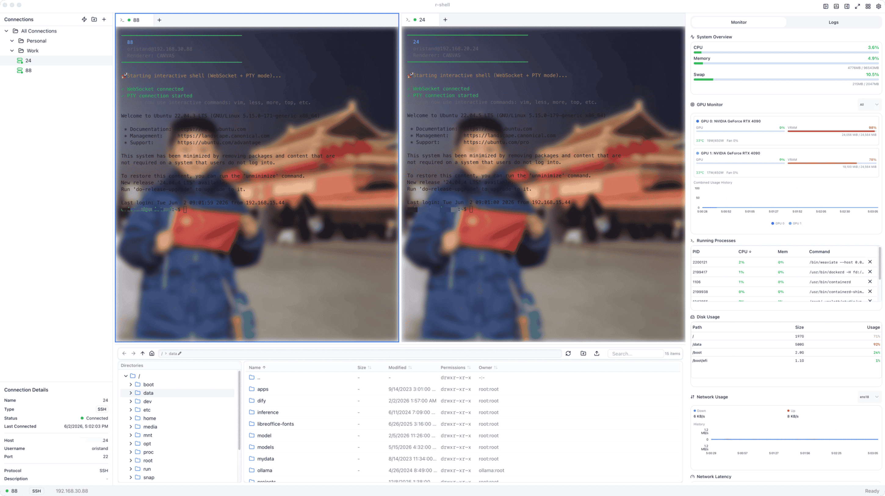

<div align="center">

# NexTerm

**A native cross-platform workspace for remote servers, terminals, files, documents, and API debugging.**

[中文文档](README.zh-CN.md) · [Features](#features) · [Development](#development) · [Contributing](#contributing)

[](LICENSE)
[](https://tauri.app/)
[](https://react.dev/)
[](https://www.rust-lang.org/)

</div>

---

## Overview

NexTerm is a desktop client built with React, TypeScript, Tauri 2, and Rust. It combines remote connections, interactive terminals, file operations, system monitoring, documents, developer utilities, and API debugging in one resizable workspace.

> NexTerm was developed from the R-Shell codebase. See the [R-Shell repository](https://github.com/GOODBOY008/r-shell) for the upstream project.

## Features

### Connections and terminal

- SSH, SFTP, FTP, FTPS, RDP, and VNC connection profiles.
- Password, key-based, proxy, jump-host, and protocol-specific authentication settings.
- xterm.js terminal with WebSocket PTY streaming, search, links, images, IME/CJK input, and configurable appearance.
- Split terminal groups, draggable tabs, session restoration, reconnecting, and persisted layouts.
- Connection folders, favorites, tags, profiles, and server resource summaries.

### Files and remote operations

- Dual-pane local/remote file manager with transfers, queues, retry, progress, and directory operations.
- Directory synchronization with comparison, review, direction, and exclusion options.
- Remote process, system, network, GPU, and log monitoring.
- Multi-source log viewer for files, journalctl, Docker, and custom paths.

### Toolbox

- Saved local applications, remote tunnels, local services, and service orchestrations.
- Encrypted records notebook and notes.
- Word and Excel document import, editing, version history, and native document export.
- JAR/WAR/EAR inspection, decompilation, search, source navigation, dependency browsing, and source export.

### API debugger

- REST methods, saved collections, environments, variable substitution, Basic/Bearer/API-key authentication, and request history.
- Raw JSON, form URL-encoded, and multipart/form-data bodies with file upload.
- Response limits, streaming previews, cancellation, response metadata, JSON/raw views, and binary handling.
- Safe declarative assertions for status, headers, JSON paths, and response time.
- Sequential collection runner with stop-on-failure reporting.
- WebSocket debugging with message history, truncation limits, connection status, and explicit close handling.

### Data and security

- SQLite-backed normalized persistence with encrypted sensitive fields protected by the application lock.
- Encrypted application data at rest for saved credentials and sensitive toolbox data.
- Plain ZIP configuration export/import, protected by application-lock verification before export.
- Document history is bounded to the latest three versions per document.

## Screenshots

<div align="center">
  
</div>

## Technology

| Layer | Main technologies |
| --- | --- |
| Desktop | Tauri 2, Rust, Tokio |
| Frontend | React 19, TypeScript, Vite, Tailwind CSS |
| Terminal | xterm.js and WebSocket PTY streaming |
| Remote protocols | russh, russh-sftp, suppaftp, RDP, VNC |
| Storage | SQLite, AES-GCM field encryption |
| UI | Radix UI, shadcn/ui, Lucide, Recharts |

## Development

### Prerequisites

- Node.js 18 or newer
- pnpm 9
- Rust and Cargo
- Platform-specific Tauri prerequisites: see the [Tauri prerequisites guide](https://v2.tauri.app/start/prerequisites/)

### Start

```bash
git clone https://github.com/guojianfeng0525-debug/NexTerm.git
cd NexTerm
pnpm install

# Frontend only, with Vite Fast Refresh
pnpm dev

# Desktop application, with Tauri and Vite hot reload
pnpm tauri dev
```

For Tauri development, edit frontend files under `src/` while `pnpm tauri dev` is running. Frontend changes use Vite Fast Refresh; Rust changes rebuild the backend.

### Build

```bash
pnpm build
pnpm tauri build
```

### Test and validate

```bash
pnpm test
pnpm exec tsc --noEmit
pnpm lint
pnpm i18n:check

cd src-tauri
cargo test
```

## Project structure

```text
NexTerm/
├── src/
│   ├── components/        # React features, terminal, toolbox, UI primitives
│   ├── lib/               # State, persistence, i18n, API/debugger logic
│   └── locales/           # English and Simplified Chinese translations
├── src-tauri/
│   └── src/
│       ├── ssh/           # SSH/SFTP implementation
│       ├── commands.rs    # Tauri IPC commands
│       ├── toolbox.rs     # Tunnels, services, API and WebSocket tools
│       ├── documents.rs   # Word/Excel document backend
│       └── websocket_server.rs # PTY stream server
├── screenshots/
└── scripts/
```

## Contributing

Contributions, issue reports, and documentation improvements are welcome.

1. Fork the repository.
2. Create a branch: `git checkout -b feature/your-change`.
3. Run the relevant checks before committing.
4. Open a pull request with the problem, solution, and verification details.

Read [CONTRIBUTING.md](CONTRIBUTING.md) and [CODE_OF_CONDUCT.md](CODE_OF_CONDUCT.md) before contributing.

## License

[MIT](LICENSE)

## Links

- [Issues](https://github.com/guojianfeng0525-debug/NexTerm/issues)
- [Discussions](https://github.com/guojianfeng0525-debug/NexTerm/discussions)
- [Pull requests](https://github.com/guojianfeng0525-debug/NexTerm/pulls)
- [Upstream: R-Shell](https://github.com/GOODBOY008/r-shell)
