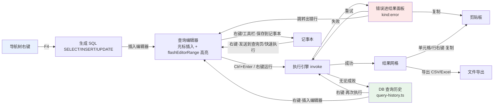

# NexTerm 数据库工具箱产品设计规格书（迭代 MVP）

> 作者：product-designer ｜ 日期：2026-08-28 ｜ 版本：v0.2（与视觉规格 v0.2 对齐）
> 输入文档：《数据库工具竞品分析报告》（`docs/analysis/db-tool-competitor-analysis.md`）、《数据库工具箱现有实现审计报告》（`docs/analysis/db-toolbox-implementation-audit.md`）
> 配套文档：UI/UX 视觉规格（uiux-designer 的 `db-toolbox-ux-spec.md`，本文 §3 联动契约引用其 §4.4，F2 错误态引用其 §2.2.2，F5 历史视图引用其 §4.5）
> 范围：仅数据库工具箱（PostgreSQL / MySQL / SQLite）。**不含 AI / BI / ER。**

---

## 1. 产品目标与范围声明

### 1.1 本迭代要达成的用户价值

> 把「能用」的数据库工具箱升级为「顺手、可依赖」的数据库工作台：**三种数据库（PostgreSQL / MySQL / SQLite）获得一致的右键菜单、快捷键与结构化错误体验**；当一条 SQL 执行失败时，用户能**立刻知道错在哪一行、为什么错、怎么重试**，而不是面对一条转瞬即逝的原始报错 toast；从导航树到查询结果再到历史记录的**主要操作链路被右键与快捷键彻底打通**，让"看数据 → 写 SQL → 排错 → 复用"成为一条不断线的肌肉记忆流。

一句话：**消灭"三端体验落差"与"错误即失联"，让高频路径（生成 SQL / 执行 / 排错 / 再次执行）全程可右键、可快捷键、可回放。**

### 1.2 做 / 不做清单

| 类别 | 内容 |
|---|---|
| ✅ **做（本迭代）** | ① MySQL/SQLite 三件套补齐（右键菜单 + 快捷键 + 结构化错误）② 错误信息工程化（定位出错行 / 可复制 / 可重试 / 错误进结果面板）③ 接入现成 scope-router 快捷键机制 ④ 导航树右键生成 SQL（SELECT / INSERT / UPDATE）⑤ DB 域查询历史贯穿（执行 / 再次执行） |
| ❌ **不做（明确排除）** | AI 辅助 / BI 图表 / ER 图（含外键可视化）；完整快捷键可视化自定义面板（设置页重绑 + 冲突检测 UI）；命令面板 Cmd+K / Ctrl+P fuzzy 搜索；INSERT 文本↔表格编辑（Edit as Table）；外键 / 相关行导航（F4 Related Rows）；连接级 Safe mode / 生产只读保护；结果集 → INSERT 生成（Navicat 式）；SQL 保存为 .sql 文件；连接深链 URL（TablePlus Copy as URL）；多语句遇错策略可配置（Return on error 开关）；服务端通知（RAISE NOTICE / SHOW WARNINGS）展示 |
| 🕐 **延后（下一迭代候选）** | 快捷键可视化自定义 + 冲突检测（机制先跑通，UI 后置）；表设计器 / 对象查看器右键增强（复制列定义 / 在编辑器打开 DDL）；MySQL/SQLite 反向联动（SQL→记事本、快速执行）；结果面板消息区右键；多选对象批量生成 SQL / 批量导出；命令面板 Cmd+K |

---

## 2. 迭代范围裁定

### 2.1 MVP 范围总览

| 编号 | 特性 | 来源（审计） | 优先级 | 子项数 |
|---|---|---|---|---|
| F1 | MySQL / SQLite 三件套补齐 | P0-1 | **P0** | 3（右键/快捷键/错误） |
| F2 | 错误信息工程化 | P0-2 | **P0** | 4（定位/复制/重试/进面板） |
| F3 | 接入 B20 scope-router 快捷键机制 | P0-3 | **P0** | 2（hook 接入/收敛手写 keydown） |
| F4 | 导航树右键生成 SQL | P1-4 | **P1** | 3（SELECT/INSERT/UPDATE） |
| F5 | DB 域查询历史贯穿 | P2-8 | **P1** | 3（记录/面板/再次执行） |

> 裁定说明：审计 P2-8「查询历史」从 P2 提为 **P1 并进 MVP**——它是"再次执行"闭环的唯一载体，是竞品（TablePlus/Navicat/DBeaver 三家标配）的最低共同点，也是 F2 重试动作的长期归宿。

### 2.2 延后项（含理由）

| 延后项 | 来源 | 延后理由 |
|---|---|---|
| 快捷键可视化自定义面板 | P1-5 | 依赖 F3 的 scope-router 先在生产环境跑稳；bindings 表已可被读取，UI 是纯增量 |
| 表设计器 / 对象查看器右键 | P1-6 | 三端（PG/MySQL/SQLite）主链路未对齐前，边缘场景优先级低 |
| 命令面板 Cmd+K | 竞品 C2 | 独立大特性，需全局命令索引，单独排期 |
| INSERT↔表格编辑 / 外键导航 / Safe mode | 竞品 D3/D4/D6 | 均为超出现有数据模型的中长期项，不适合挤入本迭代 |
| 多语句遇错策略 | 竞品 B5 | 需要 Rust 端执行引擎配合，单独迭代 |

### 2.3 入选特性详细规格

---

#### 特性 F1：MySQL / SQLite 三件套补齐（右键菜单 + 快捷键 + 结构化错误）

**优先级：P0** ｜ 来源：审计 P0-1 ｜ 目标：`tool-mysql.tsx` / `tool-sqlite.tsx` 从"Experimental 能用"对齐到 PG 同等交互密度。

**背景**：审计确认 `tool-mysql.tsx`、`tool-sqlite.tsx` 全文无 `ContextMenu` / `ContextMenuItem` / `renderContextMenu` 引用（审计 §1.2）；两工具零 keydown 处理（审计 §3.2-6）；错误为 `toast.error(..., { description: String(error) })` 原始透传（tool-mysql.tsx:217-220、tool-sqlite.tsx:102）。而 PG 已具备完整右键（tool-postgres.tsx:2427-2530/2639-2756/2898-2965）、快捷键（2087-2208）、连接错误 action 先例（752-771）。

**设计原则**：**复用组件与 PG 完全同构，不复制逻辑**。数据库导航器（database-navigator.tsx:148-202）与结果面板（database-result-pane.tsx:192-243/623-657）已带右键触发点，只需由 MySQL/SQLite 工具传入 `renderContextMenu`；快捷键经 F3 的共享 hook 接入，无需各自手写。

##### F1.1 MySQL/SQLite 右键菜单补齐

**用户故事**：作为 MySQL 或 SQLite 用户，我在导航树、查询编辑器、结果网格、工作区 Tab 上右键时，**能获得与 PostgreSQL 用户同等的菜单**——打开数据、生成 SQL、复制、筛选、执行、关闭 Tab，而不是右键毫无反应。

**验收标准**：

- [ ] **Given** 已连接一个 MySQL/SQLite 连接且导航树已加载表，**When** 在表节点上右键，**Then** 弹出菜单，至少含：打开数据、复制名称、生成 DDL、生成 SQL（子菜单：SELECT/INSERT/UPDATE，见 F4）、刷新、Drop（带确认）。
- [ ] **Given** 查询编辑器中有焦点，**When** 右键，**Then** 菜单含：运行 / 运行选择、格式化、注释/取消注释、保存到记事本、复制。
- [ ] **Given** 结果网格有数据，**When** 在单元格上右键，**Then** 菜单含：复制单元格、复制行、复制列名、按字段值筛选、自定义筛选、设为 NULL / 空串 / 生成 UUID、删除记录、导出 CSV/Excel（**能力按 provider 裁定**：SQLite 若 `supportsResultEditing=false`，则隐藏编辑/删除类项——用 `resolveDatabaseCommand` 的能力门控，command-registry.ts:96-107）。
- [ ] **Given** 结果网格有列头，**When** 在列头右键，**Then** 菜单含：筛选排序、冻结列/取消冻结、设置列宽、最佳宽度、显示字段类型。
- [ ] **Given** 有 ≥2 个工作区 Tab，**When** 在 Tab 上右键，**Then** 菜单含：关闭、关闭其他。
- [ ] **Given** SQLite 连接为 `readOnly`，**When** 右键任何位置，**Then** 不出现写入类菜单项（编辑/删除/Drop/清空）。

**预估改动面**：

| 文件 | 改动 |
|---|---|
| `src/components/toolbox/tool-mysql.tsx` | 导航树/编辑器/结果网格/Tab 四处 `renderContextMenu`；把 PG 的菜单结构抽为共享构建函数后复用 |
| `src/components/toolbox/tool-sqlite.tsx` | 同左（注意其 DatabaseNavigator 调用在 tool-sqlite.tsx:143 未传 renderContextMenu） |
| `src/components/toolbox/tool-postgres.tsx` | 将 2427-2530/2639-2756/2898-2965 的菜单 JSX 抽到可复用位置（如 `src/components/toolbox/db-context-menus.tsx`），供三端引用，避免三份复制 |
| `src/components/toolbox/database-result-pane.tsx` | 无改动（触发点已存在），仅确认 readOnly/不可编辑态下菜单项由父级裁剪 |

**优先级：P0**

---

##### F1.2 MySQL/SQLite 快捷键补齐

**用户故事**：作为 MySQL/SQLite 用户，我按 `Ctrl+Enter` 就能执行当前 SQL，按 `Ctrl+Shift+F` 格式化、`Ctrl+/` 注释——和 PostgreSQL 及主流数据库工具（DBeaver/Beekeeper/DataGrip）保持一致，不需要每次去点工具栏。

**关键裁定（键位）**：对齐竞品洞察 C1，**执行主键采用 `Ctrl+Enter`**，保留 bindings.ts 中 Navicat 系 `Ctrl+Shift+R` / `Ctrl+E` 作为别名（scope-router 支持同一 commandId 多 combo，bindings.ts:37-46）。因此 bindings.ts 需新增一条 `Ctrl+Enter` 绑定。格式化 `Ctrl+Shift+F`、注释 `Ctrl+/`、EXPLAIN `Ctrl+Shift+E`、停止 `Ctrl+T`、新建 `Ctrl+N`、关闭 `Ctrl+W` 沿用 NAVICAT_BINDINGS（bindings.ts:9-95）。

**验收标准**：

- [ ] **Given** MySQL/SQLite 查询编辑器有焦点且已连接，**When** 按 `Ctrl+Enter`，**Then** 执行当前语句或选中语句（与 PG 行为一致）。
- [ ] **Given** 同上，**When** 按 `Ctrl+Shift+F` / `Ctrl+/`，**Then** 格式化 / 注释生效。
- [ ] **Given** 同上，**When** 按 `Ctrl+N`，**Then** 新建查询 Tab；按 `Ctrl+W`，**Then** 关闭当前 Tab。
- [ ] **Given** MySQL/SQLite 结果网格有焦点，**When** 按 `Ctrl+R`，**Then** 打开筛选排序（若 provider 支持）；按 `Escape` 清筛选。
- [ ] **Given** 焦点在 CodeMirror 编辑器内，**When** 按下 `Ctrl+Enter`，**Then** 编辑器内的换行/默认行为不被触发（`preventDefault` 且走执行）。

**预估改动面**：

| 文件 | 改动 |
|---|---|
| `src/lib/keyboard/bindings.ts` | `database.query.execute` 增加 `Ctrl+Enter` combo；如需约束，用 scopes 仅限 `QUERY_EDITOR` |
| 由 F3 的统一 hook 承载 | MySQL/SQLite 不再新增任何手写 keydown，全部经 scope-router |

**优先级：P0**

---

##### F1.3 MySQL/SQLite 错误结构化

**用户故事**：作为 MySQL/SQLite 用户，当我的 SQL 执行失败时，我看到的错误**不再是一条一闪而过的原始字符串 toast**，而是进入结果面板、可复制、可重试、带错误码解释的标准错误视图——和 PostgreSQL 完全一致（具体能力对齐见 F2）。

**验收标准**：

- [ ] **Given** 执行一条失败 SQL（如 MySQL `SELECT * FROM nonexist`），**When** 执行返回错误，**Then** 错误进入结果面板的错误态渲染（F2 的 `kind:"error"`），而非仅 toast。
- [ ] **Given** 上述错误出现在结果面板，**When** 点击复制按钮，**Then** 完整错误文本（含服务端原始消息与错误码）进入剪贴板。
- [ ] **Given** 上述错误出现在结果面板，**When** 点击重试按钮，**Then** 原 SQL 重新执行。
- [ ] **Given** 错误码已知（MySQL 1045/1049/1064/1146，SQLite 如 `no such table`），**When** 查看错误详情，**Then** 显示内置错误码解释与排查引导（见 F2-能力 3），未知错误码显示原始文本。

**预估改动面**：与 F2 共用错误管道（result-types.ts / database-result-pane.tsx / 错误码知识库模块），MySQL/SQLite 工具侧仅把 `String(error)` 替换为结构化转换（见 F2 改动面表格，工具侧改动量小）。

**优先级：P0**

---

#### 特性 F2：错误信息工程化（定位出错行 / 可复制 / 可重试 / 错误进结果面板）

**优先级：P0** ｜ 来源：审计 P0-2 ｜ 目标：**执行失败不再是信息黑洞**。

**背景**：当前 PG 执行错误走 `toast.error(title, { description: String(error) })`（tool-postgres.tsx:983-991、1257-1260），Rust 端 `format!("PostgreSQL query failed: {error}")` 原始透传（src-tauri/src/postgres.rs:828）。`DatabaseResult` 仅 `tabular/command/empty` 三种（result-types.ts:100-103），**无 error kind**；结果面板 message 区只渲染 `labels.ready`（database-result-pane.tsx:801-803），错误切换 Tab 即丢。前端已有语句 tokenizer（`currentStatementAt`，`src/lib/database/sql-statement-tokenizer.ts`）可定位语句范围，但从未与错误关联。PG 已有连接错误的 action 先例（tool-postgres.tsx:752-771）。

**设计裁定**：

1. **数据模型**：`DatabaseResult` 增加第四种 `DatabaseErrorResult`（`kind:"error"`），携带结构化错误字段（见下）。
2. **结构化错误字段**（新增 `StructuredQueryError` 类型）：
   - `message`：面向用户的精炼消息；
   - `rawMessage`：服务端原始消息（完整保留，供复制）；
   - `code`：错误码（PG SQLSTATE / MySQL errno / SQLite 消息头），可空；
   - `position`：PG 特有的字符偏移（服务端 `position` 字段），可空——用于定位；
   - `line`：换算后的**编辑器行号（1-based）**，由 `position` 经 tokenizer 换算，可空；
   - `retryable`：是否建议重试（连接断/超时 = true，语法错 = false）；
   - `suggestion`：内置错误码解释/排查引导，可空。
3. **呈现**：错误进结果面板（`kind:"error"` 随 tab 持久）。**toast 双写裁定**：保留轻量 toast，但正文只显示精炼 `message`（≤2 行），**禁止承载 `rawMessage`**；`rawMessage` 只存在于结果面板错误区（对齐 uiux-designer §2.2.2）。连接类错误仍走 toast+action（复用 752-771 先例）。
4. **定位**：结果面板错误态提供「跳转到出错行」按钮，点击后编辑器滚动到 `line` 并临时高亮（视觉契约：滚动 + 波浪线 + 临时高亮，见 uiux-designer §2.2.1）。

**能力 1：定位出错行（PG）**

**用户故事**：作为 PostgreSQL 用户，我执行一条含语法/语义错误的长 SQL，**我希望点一下就能跳到出错的那一行**，而不是在 `LINE 37: ...` 里数行号。

**验收标准**：

- [ ] **Given** PG 服务端返回含 `position` 的错误（如 `ERROR: column "x" does not exist`，带 `LINE n`），**When** 执行失败且错误进入结果面板，**Then** 错误态显示「跳转到出错行」入口，且入口可见行号（如 `第 12 行`）。
- [ ] **Given** 点击「跳转到出错行」，**When** 编辑器中对应 SQL 已被修改（行号已失效），**Then** 尽力定位到最接近的语句位置并提示"行号可能已偏移"（降级不崩溃）。
- [ ] **Given** 错误无 `position`（如连接失败、约束冲突），**When** 渲染错误态，**Then** 不显示行号跳转入口，只显示消息/代码/重试。

**能力 2：错误可复制**

**用户故事**：作为用户，我要把错误原文贴给同事或搜索引擎，**不需要手打**。

**验收标准**：

- [ ] **Given** 结果面板显示任何执行错误，**When** 点击复制按钮（或 Ctrl+C 选中文本），**Then** 剪贴板获得 `rawMessage`（含服务端原文与错误码的完整文本，格式如 `Error 1064: You have an error in your SQL syntax...`）。
- [ ] **Given** 错误文本较长，**When** 查看，**Then** 可滚动/可全选，不被截断（truncation 由视觉规格定）。

**能力 3：可重试**

**用户故事**：作为用户，我执行失败后想原样重跑（比如连接刚抖动、超时），**不希望重新定位语句再按一次 Ctrl+Enter**。

**验收标准**：

- [ ] **Given** 结果面板显示 `retryable:true` 的错误，**When** 点击「重试」，**Then** 重新执行该语句，并显示新的执行状态（成功则覆盖错误态）。
- [ ] **Given** 结果为语法错误（`retryable:false`），**When** 查看，**Then** 重试入口隐藏或禁用，仅保留「复制」与「跳转出错行」。
- [ ] **Given** 重试执行中，**When** 等待，**Then** 显示 running 态且可 `Ctrl+T` 停止（PG 已有 postgres_cancel，tool-postgres.tsx:1163-1175；MySQL/SQLite 暂无停止，本迭代不引入）。

**能力 4：错误进结果面板（含错误码知识库）**

**用户故事**：作为用户，我切走 Tab 再切回来，**错误还在**；遇到常见错误码，**界面直接告诉我这是什么、下一步改哪里**（对齐 Navicat 错误码知识体系，竞品 B3）。

**验收标准**：

- [ ] **Given** 一条 SQL 执行失败，**When** 切换到其他 Tab 再切回，**Then** 错误态完整保留在结果面板。
- [ ] **Given** 错误码在知识库内（初始覆盖：MySQL `1045`/`1049`/`1064`/`1146`/`2003`/`2059`；PG `28P01`/`42P01`/`42703`/`42601`/`57P01`；SQLite 无 error code 时按消息关键字匹配 `no such table`/`no such column`/`syntax error`），**When** 渲染错误详情，**Then** 显示一行 `suggestion`（如 MySQL 1045 → "认证失败，检查用户名/密码/允许主机；PG 28P01 → 认证失败，检查 pg_hba.conf"）。
- [ ] **Given** 错误码不在知识库，**When** 渲染，**Then** 只显示原始消息，不显示空引导。
- [ ] **Given** 错误发生在 MySQL/SQLite，**When** 执行失败，**Then** 错误以同一 `kind:"error"` 管道渲染（与 PG 一致）。

**预估改动面**：

| 文件 | 改动 |
|---|---|
| `src/lib/database/result-types.ts` | 新增 `DatabaseErrorResult` + `StructuredQueryError` 类型；`DatabaseResult` union 扩为 4 种 |
| `src/lib/database/sql-error.ts`（新增） | `parseStructuredError(raw: string, provider)`：解析错误码/position/LINE；`position→行号`换算（复用 sql-statement-tokenizer 的 `currentStatementAt`）；错误码知识库表 |
| `src/components/toolbox/database-result-pane.tsx` | 新增 error kind 渲染分支（消息 + 复制/重试/跳转按钮），替代 801-803 的 message 区 |
| `src/components/toolbox/tool-postgres.tsx` | 983-991/1257-1260 改为：toast 仅短提示 + 把 `parseStructuredError` 结果写入 `patchTab({result: {kind:"error",...}})`；「跳转」回调绑定 CodeMirror 滚动/高亮 |
| `src/components/toolbox/tool-mysql.tsx` / `tool-sqlite.tsx` | 同左（F1.3） |
| `src/components/code-editor.tsx` | 暴露定位/高亮入口（视觉契约：滚动 + 波浪线 + 临时高亮），如 `flashEditorRange` 或 `jumpToLine` prop/命令 |
| `src-tauri/src/postgres.rs` | 可选：828 处错误保留 `position` 字段透出（若 Display 已有 `LINE n` 则前端可解析，Rust 改动为低优先级） |
| `src/lib/database/sql-statement-tokenizer.ts` | 确认/补充 `currentStatementAt` 的对外签名可被 sql-error.ts 复用 |

**优先级：P0**

---

#### 特性 F3：接入 B20 scope-router 快捷键机制

**优先级：P0** ｜ 来源：审计 P0-3 ｜ 目标：**让已经写好但"测试绿、上线无"的快捷键基础设施真正生效**，并收敛 PG 手写 keydown 重复逻辑。

**背景**：`src/lib/keyboard/scope-router.ts` 已实现 `resolveScope`（80-95）与 `routeKeyEvent`（104-146），scope 优先级 `DIALOG > QUERY_EDITOR/DATA_GRID > NAVIGATOR > DATABASE_WORKSPACE > GLOBAL`，且内置 xterm 硬边界（74-77）。`bindings.ts` 定义了 18 组 NAVICAT_BINDINGS（9-95）。`command-registry.ts` 每个命令带 `defaultBinding` 与能力门控（`resolveDatabaseCommand`，536-570）。**但全项目只有 `__tests__/scope-router.test.ts` 引用，没有任何生产 hook 把 `routeKeyEvent` 挂到 DOM。** PG 实际生效的是手写 `onDatabaseKeyDown`（tool-postgres.tsx:2087-2208 + window keydown 2204-2208），与 bindings 表完全割裂；MySQL/SQLite 零快捷键。

**设计裁定**：

1. 新增共享 hook `useDatabaseKeyboardShortcuts(handlers)`（建议 `src/components/toolbox/use-database-keyboard.ts`），职责：
   - 挂载 window keydown；
   - 构造 `ScopeContext`（dialogOpen + activeElement + anchors，anchors 需给 CodeMirror/网格/导航树/Dialog 补统一 data-testid 或 class 选择器）；
   - 调 `resolveScope` → `routeKeyEvent(event, scope, NAVICAT_BINDINGS)`；
   - 命中后按 `commandId` 分发给各工具注册的 handler（如 `database.query.execute → runSelectionOrStatement`），并 `preventDefault`；
   - xterm 边界自动生效（不拦截终端输入）。
2. **PG 收敛**：tool-postgres.tsx:2087-2208 的手写 keydown **删除**，行为迁移到 hook + handler 映射；保留极少数 PG 特有分支（如 `Ctrl+Shift+R` 运行当前语句 vs `Ctrl+Enter` 运行选择的差异语义）由 handler 内部分辨。
3. **F5 刷新导航树**：bindings 已声明 `database.object.refresh` F5（bindings.ts:69-77）但 PG keydown 无此分支，接入后自动生效。
4. **DESIGNER 域**：`database.design.save` Ctrl+S / `database.design.revert` Escape（command-registry.ts:507-519）同步接入表设计器（table-designer-tab.tsx），由 hook 的 DIALOG/DESIGNER 优先级保证对话框打开时不误触。

**验收标准**：

- [ ] **Given** 打开数据库工具箱（任一 provider），**When** 按 NAVICAT_BINDINGS 中任意 combo，**Then** 对应命令执行且与焦点所在 scope 匹配（编辑器内 Ctrl+Enter 执行、网格内 Ctrl+R 筛选、导航树内 F5 刷新、任何位置 Ctrl+N 新建查询）。
- [ ] **Given** 焦点在 xterm 终端内，**When** 按下任何 NAVICAT_BINDINGS combo，**Then** 事件不被拦截（终端行为不变）。
- [ ] **Given** 打开连接对话框/筛选对话框（DIALOG scope），**When** 按 `Ctrl+W`/`Ctrl+N`，**Then** 对话框优先处理，不触发工作区命令。
- [ ] **Given** PG 工具打开，**When** 对比接入前后行为，**Then** 原手写 keydown 支持的每个快捷键在接入后行为一致（回归清单：Insert 加记录、Ctrl+F 查找、F3/Esc find、Ctrl+N、Ctrl+Enter、Ctrl+Shift+E、Ctrl+T、Ctrl+/、Ctrl+Shift+F、Ctrl+Shift+R、Ctrl+E、Ctrl+W、Ctrl+S、Ctrl+R）。
- [ ] **Given** 表设计器打开，**When** 按 `Ctrl+S`，**Then** 保存设计（DESIGNER 域生效）。
- [ ] **Given** `__tests__/scope-router.test.ts` 及相关测试，**When** 跑测试，**Then** 保持全绿（router 本身不改语义）。

**预估改动面**：

| 文件 | 改动 |
|---|---|
| `src/components/toolbox/use-database-keyboard.ts`（新增） | 共享 hook（挂载、scope 解析、路由分发） |
| `src/components/toolbox/tool-postgres.tsx` | 删除 2087-2208 手写 keydown；注册 handler 映射；补 anchors data-testid |
| `src/components/toolbox/tool-mysql.tsx` / `tool-sqlite.tsx` | 挂载同一 hook，注册对应 handler（F1.2 的快捷键经此生效） |
| `src/components/toolbox/table-designer-tab.tsx` | 注册 DESIGNER 域 handler（Ctrl+S/Escape） |
| `src/components/toolbox/database-result-pane.tsx` / `database-navigator.tsx` | 补 scope anchors 所需的选择器（如 `data-testid`） |
| `src/lib/keyboard/bindings.ts` | execute 增加 Ctrl+Enter（F1.2 裁定） |

**优先级：P0**

---

#### 特性 F4：导航树右键生成 SQL（SELECT / INSERT / UPDATE）

**优先级：P1** ｜ 来源：审计 P1-4、竞品 D1 ｜ 目标：**右键表 → 生成可直接执行的 SQL 模板，插入当前或新查询 Tab**——数据库工作台的第一联动（Navicat/DBeaver/DataGrip 三家标配）。

**背景**：全项目无 `generateSelectSql/generateInsertSql/generateUpdateSql`（审计 §4.2-1）。现有引用模型已具备：PG `PostgresRelationReference`（postgresql-object-loader.ts:41-47）、MySQL `getMySQLRelationReference`（mysql-object-loader.ts:40，含 connectionId/database/relation）、SQLite `getSqliteRelationReference`（sqlite-object-loader.ts:75）。INSERT/UPDATE 需列清单，PG 已有表设计列模型（table-design.ts:11-20 `TableDesignColumn`）；MySQL/SQLite 缺列元数据查询命令，需新增薄命令。

**设计裁定**：

1. **模板产物**：
   - `SELECT * FROM "<schema>."<table>" LIMIT 100;`（PG 带 schema；MySQL 带 database；SQLite 带引号转义，参考现有 `SELECT * FROM "x" LIMIT 100`，tool-sqlite.tsx:143 onOpen）
   - `INSERT INTO "<table>" ("col1", "col2", ...) VALUES (?, ?, ...);`（列来自表元数据）
   - `UPDATE "<table>" SET "col1" = ?, ... WHERE <primary key 条件占位>;`（主键来自表元数据；无主键则生成 `WHERE 1=1 -- 请补充条件` 占位）
2. **落点**：右键菜单「生成 SQL」子菜单（SELECT / INSERT / UPDATE / 全部）→ **插入当前查询 Tab 光标处**，若当前无查询 Tab 则新建（对齐视觉契约 §4.4：新 tab + 光标插入 + 语句 2s 高亮 `flashEditorRange`）。复用"保存到记事本"已有的三级来源判定/插入编辑器的实现思路（tool-postgres.tsx:1003-1033、451-463）。
3. **列元数据获取**：新增 `*_catalog_columns` 薄命令（PG 复用/对齐 table-design 加载，MySQL `information_schema.columns`，SQLite `PRAGMA table_info`）；命令失败时降级：SELECT 照常生成，INSERT/UPDATE 隐藏或禁用。
4. **范围**：**仅单表**，不做多选批量生成、不做 JOIN 生成、不做跨库。

**验收标准**：

- [ ] **Given** 已连接 PG 且导航树加载了 `public.users`，**When** 右键表 → 生成 SQL → SELECT，**Then** 生成 `SELECT * FROM "public"."users" LIMIT 100;` 并插入当前查询 Tab 光标处（无 Tab 则新建），语句高亮 2s。
- [ ] **Given** 同上，**When** 右键 → 生成 SQL → INSERT，**Then** 生成含全部列名的 `INSERT INTO ... VALUES (...);` 模板，列名与表元数据一致。
- [ ] **Given** 同上且表有主键，**When** 右键 → 生成 SQL → UPDATE，**Then** 生成 `UPDATE ... SET ... WHERE <主键列> = ?;` 模板。
- [ ] **Given** 表无主键，**When** 生成 UPDATE，**Then** 生成 `WHERE 1=1 -- TODO: 补充更新条件` 占位（不崩溃、有提示）。
- [ ] **Given** MySQL/SQLite 已连接，**When** 右键表 → 生成 SQL → SELECT/INSERT/UPDATE，**Then** 行为与 PG 一致（引号/标识符按各 provider 方言转义）。
- [ ] **Given** 列元数据加载失败（如断网/权限），**When** 右键，**Then** SELECT 仍可用，INSERT/UPDATE 隐藏且菜单给出原因提示。
- [ ] **Given** 生成 SQL 后立即按 `Ctrl+Enter`，**When** 执行，**Then** SQL 可直接运行（模板语法正确）。

**预估改动面**：

| 文件 | 改动 |
|---|---|
| `src/lib/database/sql-dml-generator.ts`（新增） | `generateSelectSql` / `generateInsertSql` / `generateUpdateSql`（输入 relation 引用 + 列/主键元数据） |
| `src/components/toolbox/db-context-menus.tsx`（新增，见 F1） | 导航树「生成 SQL」子菜单统一实现，三端复用 |
| `src/components/toolbox/tool-postgres.tsx` | 接入菜单；插入编辑器逻辑（复用 451-463 的 paste 事件或直接调用插入函数） |
| `src/components/toolbox/tool-mysql.tsx` / `tool-sqlite.tsx` | 同上 |
| `src-tauri/src/*.rs` | 新增 `postgres_catalog_columns` / `mysql_catalog_columns` / `sqlite_catalog_columns` 薄命令（SQLite 可用 PRAGMA） |
| `src/lib/database/table-design.ts` | 确认 PG 列模型可被 DML 生成复用（只读引用） |
| `src/components/code-editor.tsx` | `flashEditorRange`（视觉契约 §4.4） |

**优先级：P1**

---

#### 特性 F5：DB 域查询历史贯穿（执行 / 再次执行）

**优先级：P1** ｜ 来源：审计 P2-8、竞品 D6 / TablePlus 历史右键 ｜ 目标：**执行过的 SQL 不再消失**——可查看、可再次执行、可插入编辑器。

**背景**：`tool-command-history.tsx` 是**终端命令历史**（面向 shell，lib/command-history.ts），与 DB 查询无关；DB 侧无任何历史记录（审计 §4.2-6）。竞品中 TablePlus 历史右键最完整（复制/运行/插入编辑器/收藏/删除，竞品 §1.4）、Navicat Ctrl+L、DBeaver 保存为脚本。

**设计裁定**：

1. **存储**：新增 `src/lib/database/query-history.ts`，localStorage 按 `connectionId` 隔离，单条结构：`{ id, connectionId, providerId, sql, executedAt, status: "success"|"error", elapsedMs? }`。上限每连接 200 条，超限淘汰最旧。
2. **记录时机**：所有 provider 的 `execute` 成功/失败分支统一写入（复用 F2 的 catch 改造点，一次接入三端）。
3. **入口**：查询 Tab 工具栏加「历史」ToolButton（History 图标，位置=保存到记事本后、停止前）；点击在结果面板区域**切换视图**（结果↔历史，VS Code panel 心智，不引入浮层，对齐 uiux-designer §4.5）。**本迭代不做全局命令面板/专用快捷键**（避免与终端组合冲突）。
4. **面板（视觉对齐 §4.5）**：按连接过滤的列表，条目=h-7 行：状态徽标（成功 `bg-emerald-500` / 错误 `bg-red-500`）+ 时间（右对齐 tabular-nums）+ mono SQL 摘要（首非空行、truncate 96 字符、title 全量）+ 耗时（elapsedMs ≥500ms 才显示）。hover 仅浮现「再次执行」按钮，其余动作走右键菜单：**再次执行**（当前连接）、**插入编辑器**、**复制**、**删除单条**、**清空本连接历史**（对齐 TablePlus 历史右键）。键盘 ↑/↓/Enter/Esc 导航；空态 Inbox 图标 + 「暂无查询历史」。**错误徽标仅状态指示，不跳错误详情**（详情当刻在结果面板可见）。

**验收标准**：

- [ ] **Given** 已连接任一数据库并执行成功 1 条 SQL，**When** 打开历史面板，**Then** 该条以摘要+时间+成功徽标出现。
- [ ] **Given** 执行 1 条失败 SQL，**When** 打开历史面板，**Then** 该条带错误徽标出现（可与 F2 错误信息关联查看）。
- [ ] **Given** 历史列表有条目，**When** 右键 → 再次执行，**Then** 在当前连接重新执行该 SQL，结果进结果面板，且新执行记录追加到历史。
- [ ] **Given** 历史列表有条目，**When** 右键 → 插入编辑器，**Then** SQL 文本插入当前查询 Tab 光标处（无 Tab 则新建）。
- [ ] **Given** 切换连接后打开历史面板，**When** 查看，**Then** 只显示当前连接的历史（按 connectionId 隔离）。
- [ ] **Given** 历史超过 200 条，**When** 新记录写入，**Then** 最旧记录被淘汰，面板条目数与存储一致。
- [ ] **Given** 历史面板关闭再打开，**When** 查看，**Then** 记录持久化保留（localStorage）。

**预估改动面**：

| 文件 | 改动 |
|---|---|
| `src/lib/database/query-history.ts`（新增） | 存储读写、按连接隔离、上限淘汰 |
| `src/components/toolbox/query-history-view.tsx`（新增） | 历史视图（结果面板区域内切换）+ 右键菜单（再次执行/插入编辑器/复制/删除/清空），视觉对齐 §4.5 |
| `src/components/toolbox/tool-postgres.tsx` | execute 成功/失败分支写历史；工具栏「历史」按钮（History 图标，结果↔历史切换） |
| `src/components/toolbox/tool-mysql.tsx` / `tool-sqlite.tsx` | 同上（复用 F2 的 execute 改造点） |
| `src/lib/database/command-registry.ts` | 可选：注册历史相关命令（本迭代不强求） |

**优先级：P1**

---

## 3. 跨功能联动地图

### 3.1 本轮要打通的联动链路总览

### 3.2 联动明细表

| # | 链路 | 触发入口 | 目标 | 视觉契约（对齐 uiux-designer §4.4） | 对应特性 |
|---|---|---|---|---|---|
| L1 | 导航树 → 生成 SQL → 编辑器 | 导航树表节点右键「生成 SQL」子菜单 | 当前查询 Tab 光标处（无则新建） | 新 tab + 光标插入 + 语句 2s 高亮 `flashEditorRange`（bg-primary/10 渐隐） | F4 |
| L2 | 编辑器 → 执行 → 结果 | 编辑器右键「运行/运行选择」、`Ctrl+Enter` | 结果面板（tabular/command/error/empty） | 错误定位：滚动 + 波浪线 + 临时高亮（§2.2.1） | F2、F3 |
| L3 | 错误 → 编辑器（回跳） | 结果面板错误态「跳转到出错行」 | 编辑器滚动到出错行 | 滚动 + 波浪线 + 临时高亮（§2.2.1） | F2 |
| L4 | 错误 → 重试 → 执行 | 错误态「重试」按钮 | 重新走 L2 | 复用执行态视觉 | F2 |
| L5 | 执行 → 历史 → 再次执行 | 执行成功/失败自动记录；历史视图（结果面板区域切换）右键「再次执行」 | 重新走 L2 | 历史条目状态徽标（成功/错误，§4.5）；错误徽标仅状态指示 | F5 |
| L6 | 历史 → 编辑器 | 历史视图右键「插入编辑器」 | 查询 Tab 光标处 | 同 L1 高亮契约；历史视图交互见 §4.5 | F5 |
| L7 | 编辑器 ↔ 记事本 | 编辑器右键「保存到记事本」；记事本右键「发送到查询页/快速执行」 | 记事本 / 查询编辑器 | 保存到记事本 toast 带「查看」action 跳转 | 已有（PG）+ 本迭代 MySQL/SQLite 补齐（延后） |
| L8 | 结果网格 → 复制 / 导出 | 网格单元格/行/列头右键；导出按钮 | 剪贴板 / CSV / Excel 文件 | 无新增视觉 | 已有（PG）+ 本迭代 MySQL/SQLite 补齐 |

### 3.3 联动可达性原则

1. **每条链路至少有一个右键入口、一个快捷键入口（若可绑定）**——右键承载可发现性，快捷键承载效率（对齐 DBeaver「右键即一切」+ DataGrip「菜单标注快捷键」，竞品 A1/A4）。
2. **联动不跨 provider**：历史、生成 SQL、错误定位均为当前连接上下文内闭环；跨连接复用（如把 A 连接 SQL 插到 B 连接）不在本迭代。
3. **超出视觉契约范围的联动**：本迭代联动地图均在 uiux-designer §4.4 契约内（L1-L8 均为 生成SQL/网格行/记事本/错误定位四类）。L5/L6 历史视图为结果面板区域内的**视图切换**（非浮层），其视觉已由 uiux-designer §4.5 覆盖。

---

## 4. 用户旅程

### 场景 A：运维排查一条报错 SQL（PostgreSQL，走 F2+F3+F5 全链路）

1. **写 SQL**：运维在查询 Tab 粘贴一段 60 行的多表 JOIN SQL。
2. **执行**：按 `Ctrl+Enter`（F3 快捷键，scope-router 命中 `database.query.execute`）。
3. **发现错误**：没有 toast 一闪而过；结果面板切换为错误态，显示精炼消息 `column "create_at" does not exist` + 错误码 `42703` + 一行内置引导「列不存在：检查列名拼写或表结构」（F2-能力4）。
4. **定位**：点击「跳转到出错行（第 31 行）」→ 编辑器滚动到第 31 行，该行出现波浪线 + 临时高亮（F2-能力1）。
5. **修正**：改 `create_at` 为 `created_at`，重新 `Ctrl+Enter`，成功，结果网格出现（L2）。
6. **再次排查**：若仍失败，点「重试」验证是否偶发（F2-能力3）。
7. **沉淀**：无论成败，本次 SQL 已进历史（F5）。第二天同事问"你昨天跑的那条查询"，运维点击工具栏「历史」按钮（结果面板区域切换为历史视图），右键「插入编辑器」调出并再次执行（L5/L6）。

**新交互标注**：`Ctrl+Enter` 执行（F3）；错误进结果面板 + 复制/重试/跳转（F2）；错误码引导（F2）；历史记录与再次执行（F5）。

### 场景 B：分析师从表生成并导出数据（MySQL，走 F4+F1）

1. **找表**：分析师在 MySQL 导航树展开 `analytics` 库，定位 `user_events` 表。
2. **生成 SQL**：右键 `user_events` → 生成 SQL → SELECT，新查询 Tab 出现并自动插入 `SELECT * FROM "analytics"."user_events" LIMIT 100;`，语句高亮 2s（F4，L1）。
3. **微调**：光标已落在语句末尾（光标插入），分析师把 `*` 改成需要的字段，`LIMIT 100` 去掉或调整（F4 落点设计生效）。
4. **执行**：按 `Ctrl+Enter`，结果网格出现（F1.2 快捷键，此前 MySQL 无任何快捷键）。
5. **筛选**：在某单元格右键「按字段值筛选」，缩小范围（F1.1 网格右键，此前 MySQL 无右键）。
6. **导出**：结果网格右键「导出 CSV」，下载文件（L8）。
7. **复用**：这条 SQL 已进历史；下周同一份月报，点击「历史」按钮切换视图，右键「再次执行」直接跑（F5）。

**新交互标注**：导航树右键生成 SQL（F4）；新 Tab 光标插入 + 高亮（F4/视觉契约）；MySQL `Ctrl+Enter`（F1.2）；MySQL 网格右键筛选/导出（F1.1）；历史再次执行（F5）。

---

## 5. 成功度量

| 指标 | 定义/计算 | 目标（本迭代验收口径） | 关联特性 |
|---|---|---|---|
| **右键可达高频操作覆盖率** | 三库 × 五场景（导航树/编辑器/网格/列头/Tab）中的高频动作，可经右键到达的比例（对照竞品矩阵清单逐项勾选） | **≥ 80%**；MySQL/SQLite 从当前 ~0% 提升至与 PG 对齐 | F1.1、F4 |
| **错误定位成功率** | 带 `position`/`LINE` 的 PG 执行错误中，「跳转到出错行」可正确定位到行的比例（手工样例集 ≥20 条） | **100%**；无 position 错误降级正确（不显示跳转） | F2-能力1 |
| **错误可复制/可重试可用率** | 结果面板错误态中，「复制」与「重试」（retryable）按钮功能正常且无回归的比例 | **100%** | F2-能力2/3 |
| **错误进入结果面板持久率** | 执行失败后，错误在结果面板可见且 Tab 切换后仍保留的比例 | **100%**（当前为 0%，仅瞬时 toast） | F2-能力4 |
| **MySQL/SQLite 与 PG 的 UX 落差收敛** | 三件套逐项对比：右键菜单项集合、快捷键生效集合、错误呈现形态，三库对齐项数 / 总项数 | **≥ 90% 对齐** | F1（整体） |
| **scope-router 激活率** | NAVICAT_BINDINGS 中在生产环境实际生效的绑定数 / 18 | **100%**（当前 0，仅测试引用） | F3 |
| **手写 keydown 收敛** | tool-postgres.tsx 中被删除的手写 keydown 分支数（2087-2208） | **全部收敛**至 hook，无重复逻辑残留 | F3 |
| **生成 SQL 成功率** | 三库 × 三种生成（SELECT/INSERT/UPDATE）中，生成结果可被直接执行的比例（样例表各 ≥5 张） | **100%**（无主键 UPDATE 走占位分支，视为通过） | F4 |
| **历史贯穿闭环** | 执行 → 历史可见 → 再次执行成功 的端到端闭环成功率 | **100%**；按连接隔离正确率 100% | F5 |
| **回归门禁** | `scope-router.test.ts` 等既有键盘/菜单测试保持全绿 | **全绿** | F3 |

---

## 6. 附：跨特性依赖与风险

| 依赖 | 说明 |
|---|---|
| F1.2 依赖 F3 | MySQL/SQLite 快捷键不手写，直接经 F3 hook 生效 |
| F1.3 依赖 F2 | 错误管道先建好，MySQL/SQLite 只做接入 |
| F4 依赖 F1.1 的共享菜单模块 | 生成 SQL 子菜单挂在 db-context-menus 上，避免三份复制 |
| F5 记录时机依赖 F2 的 execute 改造点 | 三端 execute 的 catch/成功分支统一写历史 |
| 视觉依赖 | 联动高亮（flashEditorRange / 错误波浪线 / 历史面板）以 uiux-designer §4.4 为准 |

**主要风险**：

1. **scope-router anchors 选择器缺失**：CodeMirror/网格/导航树现有 DOM 若无稳定锚点，F3 的 scope 解析会退化。缓解：为关键容器补 `data-testid`（改动集中在 result-pane/navigator 两处）。
2. **PG 手写 keydown 语义差异**（Ctrl+Enter 运行选择 vs Ctrl+Shift+R 运行当前语句）：迁移时必须逐分支对照回归清单（见 F3 验收），避免行为漂移。
3. **INSERT/UPDATE 列元数据命令**：新增三条 rust 薄命令，若后端排期紧张，可降级为 SELECT-only 上线、INSERT/UPDATE 标记"不可用"（仍满足 P1 主体价值）。
4. **历史存储体积**：localStorage 每连接 200 条上限已控规模；若未来 SQL 体积大，可迁 IndexedDB（本迭代不做）。

---

*规格书完成时间：2026-08-28。下一环节：转交 feature-designer 细化实现、uiux-designer 补齐历史面板视觉 spec。*
